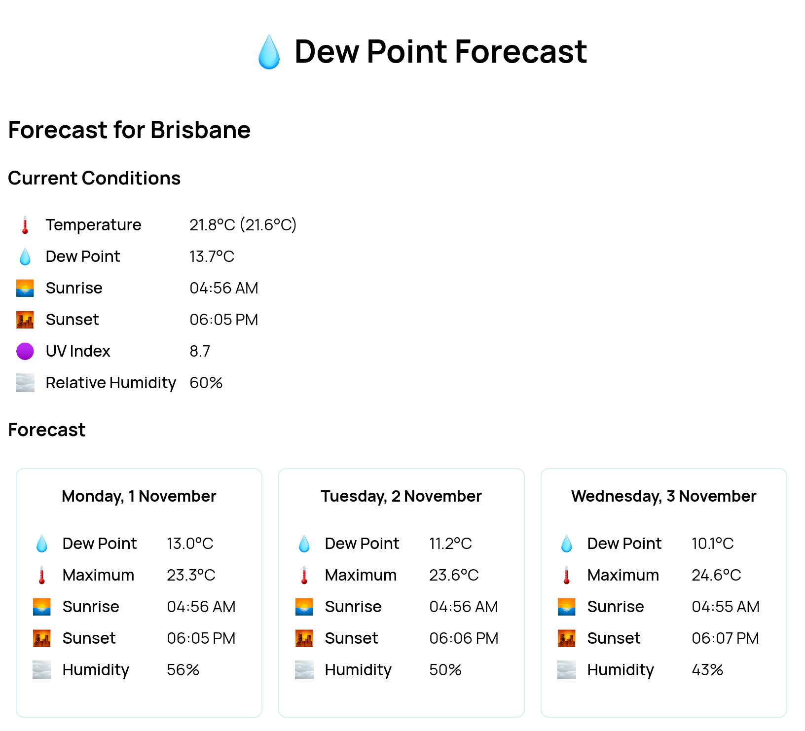

Dew Point Forecast
==================

This is a small web application that provides the dew point for forecast for a
selected location.  The dew point is the temperature at which dew forms as air
is cooled. Knowing the dewpoint is good for determining how humid a day will
feel.

Building
--------

This application is built with [Rust] using the [Rocket web framework][Rocket].
It also makes use of the IP2Location DB for mapping IPs to countries.  The
database is available from
<https://lite.ip2location.com/database/db1-ip-country> and should be placed in
the root of the project.

### Configuration

There is a sample config file in `Rocket.toml.sample`, copy this to
`Rocket.toml` and add the two keys.  For the OpenWeather API key you will need
to create an account at <https://openweathermap.org/>.

Configuration can also be done via environment variables, which is handy for
prod deployment. See the [Rocket documentation][rocket-config] for details.

### Build

    cargo build

The binary will be in `target/debug/dewpoint`.

### Production Build

Add `--release` to the build command:

    cargo build --release

The binary will be in `target/release/dewpoint`.

### Run

    cargo run

Tips
----

Fast auto-rebuilding server:

    watchexec -w src -w templates -s SIGINT -r 'mold -run cargo run'

**Note:** 

* [watchexec](https://github.com/watchexec/watchexec) watches the file-system
  and runs a command when changes are detected 
* [mold](https://github.com/rui314/mold) is a fast linker for Linux.

Licence
-------

This project is dual licenced under either of:

- Apache License, Version 2.0 ([LICENSE-APACHE](https://github.com/wezm/Quotes/blob/master/LICENSE-APACHE))
- MIT license ([LICENSE-MIT](https://github.com/wezm/Quotes/blob/master/LICENSE-MIT))

at your option.

[Rust]: https://www.rust-lang.org/
[Rocket]: https://rocket.rs/
[rocket-config]: https://rocket.rs/v0.5-rc/guide/configuration/#configuration
